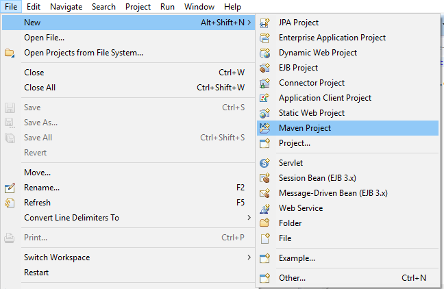
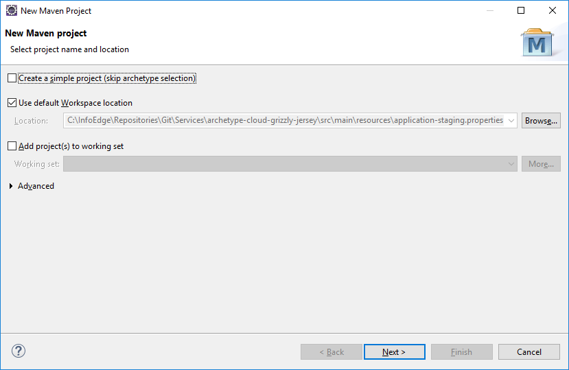
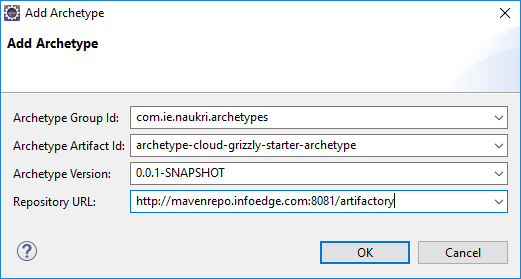
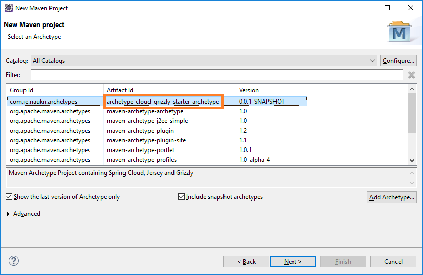
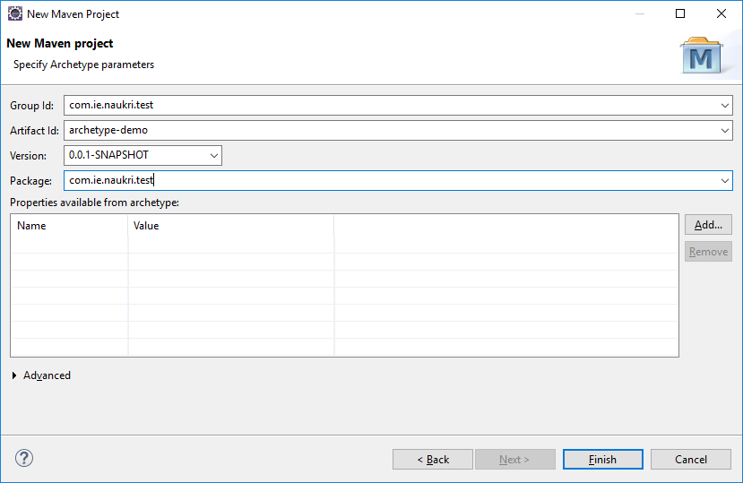

Spring Cloud Grizzly Jersey Archetype
=====================================

This repository contains an archetype (template for creating maven projects) to create projects with following components -

* Spring Boot
* [Grizzly Spring Boot Starter](https://gitlab.infoedge.com/ncservices/grizzly-spring-boot-starter)
* Jersey REST Framework
* [Tracing Spring Boot Starter](http://gitlab.infoedge.com/ncservices/tracing-spring-boot-starter)
* [Exception Framework](https://gitlab.infoedge.com/ncservices/exception-framework)
* [MySQL Spring Boot DB Starter](https://gitlab.infoedge.com/ncservices/mysql-spring-boot-starter)
* [Redis Spring Boot DB Starter](https://gitlab.infoedge.com/ncservices/redis-spring-boot-starter)
* [Aerospike Spring Boot DB Starter](https://gitlab.infoedge.com/ncservices/aerospike-spring-boot-starter)
* [Messaging Spring Boot DB Starter](https://gitlab.infoedge.com/ncservices/messaging-spring-boot-starter)
* [Rest Service Client Utils](https://gitlab.infoedge.com/ncservices/rest-service-client-utils)


Maven Setup
-----------

Please ensure that you have your Maven setup ready by following instructions mentioned on [Maven setup wiki page](https://gitlab.infoedge.com/ncservices/archetype-cloud-grizzly-jersey/wikis/maven-setup).

Creating project using Archetype from Command line
--------------------------------------------------
Here are the steps to generate project using Maven Archetype plugin - 
* Go to directory where you want to generate project code.
* Execute following Maven command:

```bash
mvn archetype:generate -DgroupId=<groupId> -DartifactId=<artifactId> -Dversion=0.1.0-SNAPSHOT -Dpackage=<basePackageName> -DarchetypeGroupId=com.ie.naukri.archetypes -DarchetypeArtifactId=archetype-cloud-grizzly-starter-archetype -DarchetypeVersion=<archetypeVersion> -DinteractiveMode=false -DarchetypeRepository=http://mavenrepo.infoedge.com/artifactory/libs-release-local
```
__Note:__ Please ensure to make following replacements - 

1. &lt;groupId> with your team group id. It should be in format - __com.ie.naukri.services.&lt;team>__
1. &lt;artifactId> with your finalized service name
1. &lt;basePackageName> with package name for your service. It should be made of your groupId and service specific token.
1. &lt;archetypeVersion> with latest [archetype version available](http://mavenrepo.infoedge.com/artifactory/webapp/#/artifacts/browse/tree/General/libs-release-local/com/ie/naukri/archetypes/archetype-cloud-grizzly-starter-archetype).


* Execute following commands to refine and commit code in git repo (__Replace placeholders with actual values before executing commands__) - 

```bash
cd <service-name>
rm DEPLOYMENT_README.md
echo "**<service-name>**" > README.md
git init
git remote add origin http://gitlab.infoedge.com/<team-group-name>/<service-name>.git
git add .
git commit
git push -u origin master
```

* Import code as Maven project in your favourite IDE.


Creating Eclipse projects using Archetype
-----------------------------------------

Here are the steps to create Maven projects based on archetype-cloud-grizzly-jersey archetype -
* Open new Maven project creation wizard using options - __File => New => Maven Project__ as shown below -  
  
   
* It will open up a new project creation wizard as shown below. Click on Next to move to archetype selection screen.  
   
   
* Click on __Add Archetype...__ button and enter requested information (group id as __com.ie.naukri.archetypes__, artifact id as __archetype-cloud-grizzly-starter-archetype__, version as [latest available version](http://mavenrepo.infoedge.com/artifactory/webapp/#/artifacts/browse/tree/General/libs-release-local/com/ie/naukri/archetypes/archetype-cloud-grizzly-starter-archetype), repository as http://mavenrepo.infoedge.com/artifactory/libs-release-local) as shown below -  
   

* Select the archetype with artifactId as __archetype-cloud-grizzly-jersey-archetype__ and latest version number as shown below -   
   
   
* Provide __groupId, artifactId, version and default package__ for the project that you want to get created -   
    
    
* You should now see this project in your project explorer.

Configuring created project
===========================

### Specifying Spring Profile
Project created from this archetype has support for multiple profiles such as dev, test, staging and prod. In order to specify the profile, please use system property __spring.profiles.active__. E.g. for starting application with dev profile, use __spring.profiles.active=dev__.

### Configuring DB properties
In order to make created project work, you need to configure db properties in your application-<profile>.properties file. Please refer to [MySQL DB Starter Documentation](https://gitlab.infoedge.com/ncservices/mysql-spring-boot-starter) for same.

### Configuring Redis properties
Project created from archetype already has Redis libraries imported into it. If you do not need to use Redis in your application, please remove following entries from your __pom.xml__ file - 
```xml
<dependency>
	<groupId>com.ie.naukri.msa.concerns</groupId>
	<artifactId>redis-spring-boot-starter</artifactId>
	<version>${redis.starter.version}</version>
</dependency>
```

If you need to use Redis, please refer to [Redis Starter Documentation](https://gitlab.infoedge.com/ncservices/redis-spring-boot-starter) for details on how to configure the properties.

### Getting local method level information in traces
Zipkin is quite useful for finding a service resulting into high latency in a chain of service calls. However, it may not always be enough to solve performance problems and we sometimes need time taken by various operations with in a service.

In order to do so, you can simply add following annotation to any method in your code to see that operation in ZipKin [traces](http://zipkin.infoedge.com/) and [dependencies](http://zipkin.infoedge.com/dependency).

```java
@TraceCall(serviceName = "<name of operation/service>")
```

Please note that for DAO calls, service name should rather be based on functionality instead of schema name and must be suffix with __-db__. Likewise, for Redis, Aerospike, Rabbit and Kafka calls, user service names as __redis-cache__,  __aerospike-cache__, __rabbit-messaging__ and __kafka-messaging__ respectively. Whole idea is to keep same name for same services to have proper dependencies view.

### Configuring Log Files location
You can specify location of log files using system property - __log.path__. If no path is specified, application will create a __logs__ folder in application directory and put all the log files in it.

### Centralized Logging
This archetype comes with centralized logging for WARN and ERROR level log messages. Messages are sent over Kafka to ElasticSearch clusters and can be viewed using [Kibana dashboard](http://applogs.infoedge.com/#/dashboard/Service-Logs).

By default, centralized logging is automatically enabled for services running with profile - __prod__. However if you would like to test configuration from your local machine, please follow below steps -
* Ensure your OpenVPN is running 
* Make an entry in /etc/hosts pointing DNS __kafka.logs.resdex.com__ to IP __10.10.115.92__ 
* Add a VM argument in your IDE: __-Dcentralized.logs.enabled=true__

In order to migrate existing microservices to centralized logging, please refer to [migration to centralized logging guide](https://gitlab.infoedge.com/ncservices/archetype-cloud-grizzly-jersey/wikis/centralized-logging-migration-guide).

### Configuring Access Logging
By default, application comes with access logging to log each request along with response code and time taken to serve the request. In order to disable it, go to __logback-spring.xml__ and change the level of logger with name __accessLogger__ from __TRACE__ to __OFF__.

Reporting Issues
================
In case of any queries and issues with this archetype, please send an email to [Amit Kumar](mailto:kumar.amit@naukri.com).